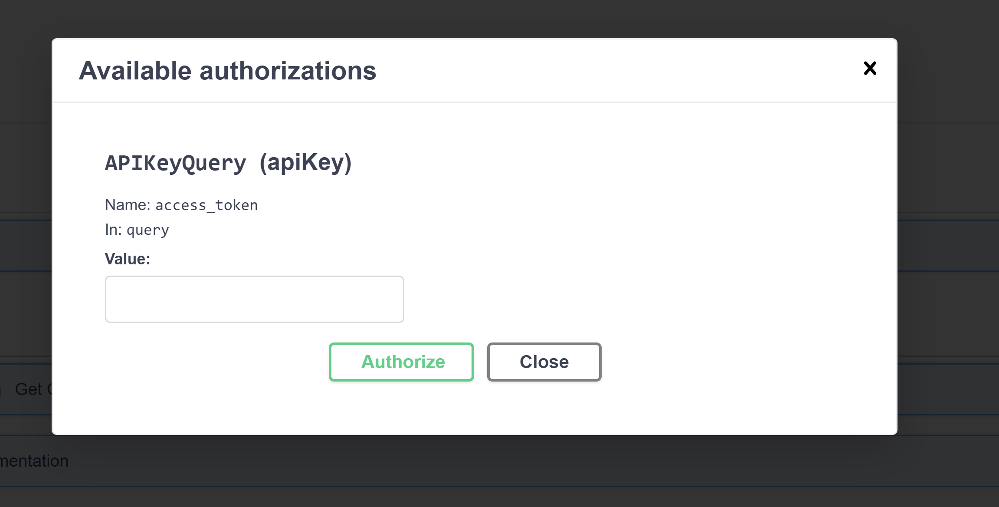
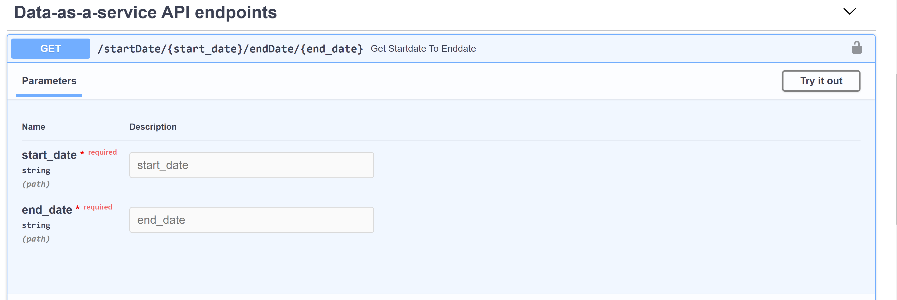
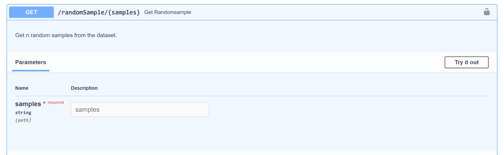
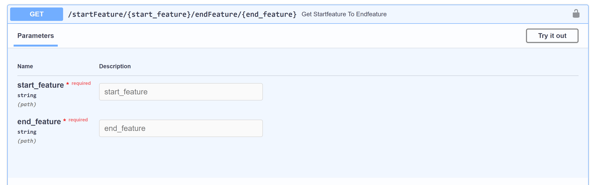
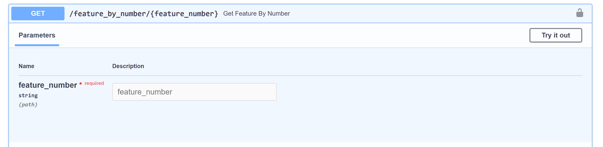

# Data as a Service - Serverless - Lambda
Using AWS serverless architecture with lambda functions and DynamoDB, we illustrate how to expose data as a service using API endpoints.

## Requirements:

AWS Amazon Web Services account to deploy and run the pipeline
Python 3.7+
## Setup: 
#### AWS Signup:
Sign up for an AWS Account. Additionally, the AWS Command Line Interface is required to interact with AWS Services. Download AWS CLI

#### Configuring your AWS CLI:
Download your AWS Access and Secret access keys for your AWS Account. Steps to generate and download your keys can be found here https://docs.amazonaws.cn/en_us/IAM/latest/UserGuide/id_credentials_access-keys.html

Open command line tool of choice on your machine and run aws configure. Enter your access and secret access keys and leave the default region name and output format as null.

#### Create an IAM Role:
Create an IAM Role on your AWS account called <any_name> with the following privileges

Lambda Basic Execution
AmazonS3 Full Access
Amazon DynamoDB Full Access

#### Building the Lambda:

- Create virtual environment  
`python -m venv enn`  
`\env\Scripts\activate`  
- create a folder with name first_lambda  
- Initiate Lambda deployment lambda init  
- This will create the following files: event.json, service.py and config.yaml.
- The service.py is the file we are interested in. Edit service.py with your Python code and we are good to go.
- Create another folder with name second_lambda and repeat the same process

#### Deploying the Lambda Function:
We can zip the contents of the directory and upload the file to the Lambda console, but let's take advantage of `python-lambda` to do it for us.  
`lambda deploy`  
This should create a new Lambda function on your AWS Lambda Console

## In FastAPI app config:
#### To Authenticate:  
Please click on authenticate icon and enter the API key to get access as shown  
  

#### End Points of API:  
- Get Data from start date to end date  
  
Enter Stat date and End Date. The API will return the data from entered start date to end date  

- Get `n` random samples from dataset  
  
The API will return random samples for the entered digit  

-  Get features for mentioned column range  
  
Enter the Start feature and End feature to get data related to those features  

-  Get data for a particular feature  

Enter the feature number and API will fetch the data related to it.

## Dataset:
https://archive.ics.uci.edu/ml/datasets/SECOM

### Reference
https://developer.moodysanalytics.com/
